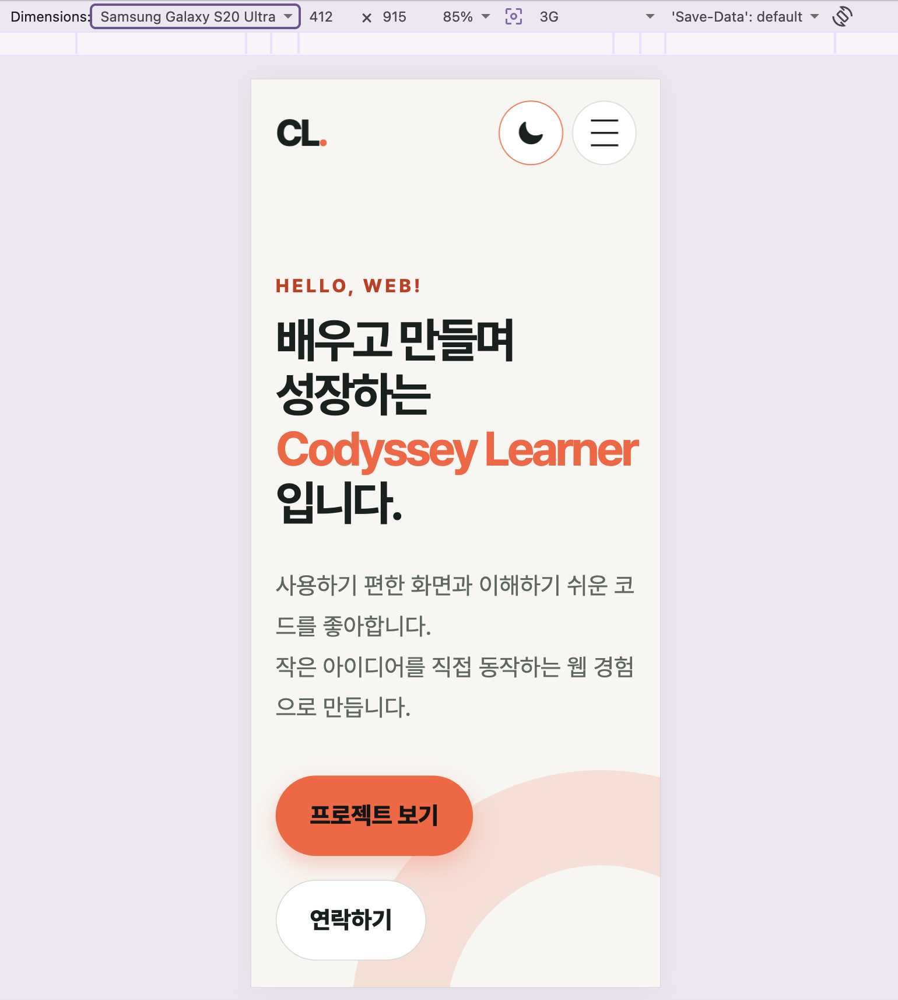

# 반응형 포트폴리오 웹사이트

외부 프레임워크 없이 HTML, CSS, JavaScript만으로 만든 단일 페이지 포트폴리오다. 모바일 퍼스트 반응형 레이아웃, 다크 모드, 스크롤 상호작용, 폼 검증, GitHub API 상태 처리를 한 프로젝트에서 구현했다.

## 구현 요구사항

- 시맨틱 태그로 Hero, About, Skills, Projects, Contact, Footer 구성
- Flexbox 네비게이션과 `auto-fit`/`minmax` 기반 Grid 프로젝트 카드
- 768px, 1024px 브레이크포인트를 사용한 모바일 퍼스트 반응형 화면
- 햄버거 메뉴, 부드러운 앵커 이동, 스크롤 탑 버튼, 스크롤 헤더, 등장 애니메이션
- 다크 모드 선택을 `localStorage`에 저장하고 새로고침 후 복원
- 이름, 이메일, 메시지의 실시간 및 제출 시 유효성 검사
- `fetch`와 `async`/`await`로 GitHub 저장소를 불러오고 로딩·성공·오류·빈 상태 렌더링
- `addEventListener`, `querySelector`, `classList`, 템플릿 리터럴, 구조분해 할당, `map`/`filter`/`forEach` 사용

## 기술 스택

- HTML5
- CSS3
- Vanilla JavaScript (ES6+)
- GitHub REST API
- GitHub Pages

## 프로젝트 구조

```text
.
├── css/
│   └── style.css          # 디자인 토큰, 반응형 레이아웃, 테마와 애니메이션
├── docs/
│   └── screenshots/       # 실행 화면
├── images/
│   └── profile-illustration.png # 대체 텍스트가 있는 프로필 일러스트
├── js/
│   └── main.js            # 이벤트, 상태, API, 폼 검증과 DOM 렌더링
├── .gitignore
├── index.html
└── README.md
```

## 핵심 구현

`js/main.js`의 `state`가 테마, 메뉴, 프로젝트 요청, 폼 상태를 보관한다. 사용자 이벤트는 상태를 바꾸고 `renderTheme`, `renderMenu`, `renderProjects`, `renderFieldError`가 화면을 갱신한다. 이 구조로 이벤트 → 상태 변경 → DOM 업데이트 흐름을 분리했다.

Projects 영역은 GitHub API 호출 전 로딩 상태를 먼저 렌더링한다. 응답에 따라 공개 저장소 카드, 빈 상태, 오류와 재시도 버튼 중 하나를 표시하며, 403 응답은 API 호출 한도 안내로 구분한다.

다크 모드는 CSS 변수만 교체한다. 선택값이 없으면 운영체제 테마를 초기값으로 사용하고, 사용자가 버튼을 누르면 `portfolio-theme` 키로 저장한다.

스크롤 기준값은 다음과 같다.

- 헤더 배경 전환: 60px
- 맨 위로 버튼 표시: 300px
- `IntersectionObserver` 등장 임계값: 0.2

## 실행 방법

VS Code에서는 프로젝트 폴더를 열고 Live Server의 `Open with Live Server`를 선택한다. 별도 확장 없이 실행하려면 다음 명령을 사용한다.

```bash
python3 -m http.server 5500
```

브라우저에서 `http://localhost:5500`을 연다. GitHub API를 사용하므로 네트워크 연결이 필요하다.

## 검증 방법

```bash
node --check js/main.js
python3 -m http.server 5500
curl -I http://localhost:5500/
```

브라우저에서는 다음을 확인한다.

1. 너비 390px에서 햄버거 메뉴가 열리고 닫히는가
2. 너비 768px, 1024px 전후에서 레이아웃이 자연스럽게 전환되는가
3. 다크 모드 전환 후 새로고침해도 선택이 유지되는가
4. 60px/300px 스크롤 후 헤더와 맨 위로 버튼이 각각 바뀌는가
5. Projects에 카드가 나타나며 네트워크를 끊었을 때 오류와 재시도 버튼이 나타나는가
6. 문의 폼의 빈 값과 잘못된 이메일에 필드별 메시지가 나타나는가

## 배포

- GitHub 저장소: [https://github.com/gpffh20/b1-1](https://github.com/gpffh20/b1-1)
- GitHub Pages: [https://gpffh20.github.io/b1-1/](https://gpffh20.github.io/b1-1/)

## 실행 결과와 스크린샷





## 배운 점

- Flexbox는 한 방향의 정렬과 네비게이션에, Grid는 행과 열이 함께 변하는 카드 목록에 적합함을 확인했다.
- 비동기 요청은 성공 결과만 그리는 것이 아니라 로딩, 오류, 빈 상태까지 하나의 상태 흐름으로 설계해야 한다.
- 폼 입력과 테마처럼 서로 다른 기능도 이벤트 → 상태 → 렌더링 구조로 정리하면 DOM 변경 지점을 찾기 쉽다.
